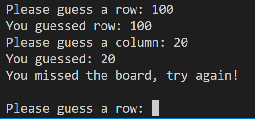
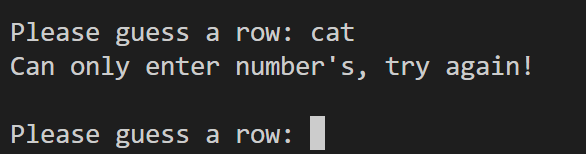

# You Sunk My Battleship!!

You sunk my battleship is a python terminal game, which runs in the Code Institute mock terminal on Heroku. 

Can you win against the computer? Find and sink the battleship hidden on the playing board and the gloy is yours!!

[Please view my live project here](https://you-sunk-my-battleship.herokuapp.com/)

Screenshot of live project here.

## Purpose of this project

I designed this project to be a simplified version of the game battleships. It can be enjoyed by any user who may come across my site. It is simple, fun and if you know the classic battleship game there is almost no learning curve. 

[Learn about the classic battleships game here](https://en.wikipedia.org/wiki/Battleship_(game))

## User Stories

As a fist time user of this game I want the experience to be fun, stress free and easy to play. I feel that I have achieved this through simple to follow prompts and full exception handling which will always bring the user back on track and get that win.

## Features

### Existing features

* The player is greeted with a welcome message, the game board is described, the coordinates layout is explained and the player is told they only have 10 guesses to try and win. 
* The player is then asked to input their name and upon entering is wished good luck in the battle against the computer.

 

* The computer generates a 5 x 5 square board.
* A ship is randomly placed and hidden within the board 

 

* The user is then prompted to guess a row and a colum to try and sink the ship.
* If its a miss the board is printed again updated with the guessed coordinates replacing the "#" with a "@" 

* The computer then takes a turn and the board is updated accordingly also.
* The game then continues until there is a hit form the user or the computer.
* The game will also end if the amount or turns exceeds 10 in which case there is a draw!

* Included in the code is input validation / exception handling. User can only use integer when guessing, the guesses must be within the bounds of the playing board and the user cannot make the same guess twice. If any of these actions are executed an on screen warning pops up and the user is asked to guess again.

### Future Features

I would like to add a player and a computer as well a having multiple ships on each board.

## Technology

The only technology used in this project was the [Python](https://en.wikipedia.org/wiki/Python_(programming_language)) coding language.

## Testing

### Code Validation

All Python code used in this project was passed through the [PEP8](http://pep8online.com/) online code validator and no errors were returned. 

### Fixed bugs

I tried using return and break statements within if statements when the player or computer had won the game but found that the exit() worked how I wanted it to by ending the function. No bugs remained after this.

## Deployment

This project was deployed using Code Institute's mock terminal for Heroku. Steps for deployment are as follows:
* Create a new app on the Heroku site 
* Add build pack ensuring Python is at the top and nodjs is below that.
* Head to the deploy tab and choose github as the deployment method. 
* Add the project repository and then you can deploy.

## Credits 

[Code Institute](https://codeinstitute.net/) for deployment terminal.
[Wikipedia](https://www.wikipedia.org/) for info on Battleship game and Python coding language.
[Stack Overflow](https://stackoverflow.com/) for queries on code syntax.
[GitHub](https://github.com/) for creating project repository.
[Gitpod](https://gitpod.io/workspaces) for building the project in a workspace.
[Heroku](https://heroku.com/) for deployinig the completed project.
[PEP8](http://pep8online.com/) for validating all code within the project.
