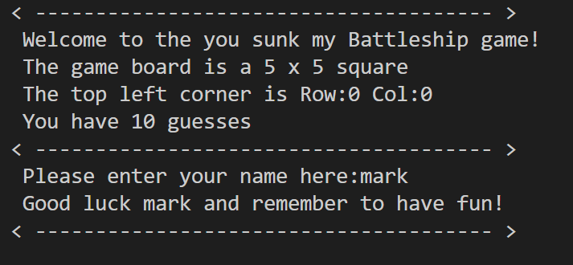
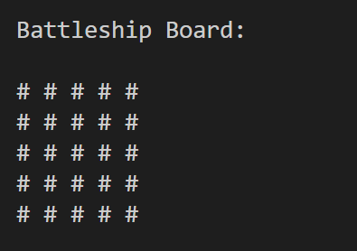
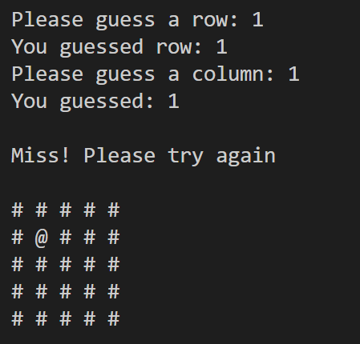
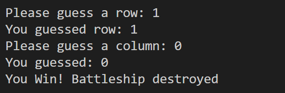

# You Sunk My Battleship!!

You sunk my battleship is a python terminal game, which runs in the Code Institute mock terminal on Heroku. 

Can you win against the computer? Find and sink the battleship hidden on the playing board and the gloy is yours!!

[Please view my live project here]()

Screenshot of live project here.

## Purpose of this project

I designed this project to be a simplified version of the game battleships. It can be enjoyed by any user who may come across my site. It is simple, fun and if you know the classic battleship game there is almost no learning curve. 

[Learn about the classic battleships game here](https://en.wikipedia.org/wiki/Battleship_(game))

## User Stories

As a fist time user of this game I want the experience to be fun, stress free and easy to play. I feel that I have achieved this through simple to follow prompts and full exception handling which will always bring the user back on track and get that win.

## Features

### Existing features
* The player is greeted with a welcome message, the game board is described, the coordinates layout is explained and the player is told they only have 10 guesses to try and win. 
* The player is then asked to input their name and upon entering is wished good luck in the battle against the computer.

 

* The computer generates a 5 x 5 square board.
* A ship is randomly placed and hidden within the board 

 

* The user is then prompted to guess a row and a colum to try and sink the ship.
* If its a miss the board is printed again updated with the guessed coordinates replacing the "#" with a "@" 

* The computer then takes a turn and the board is updated accordingly also.
* The game then continues until there is a hit form the user or the computer.
* The game will also end if the amount or turns exceeds 10 in which case there is a draw!

future features
technology
testing
   1 code validation
   2 fixed bugs
Deployment
   1 via gitpod
   2 via github pages
credits