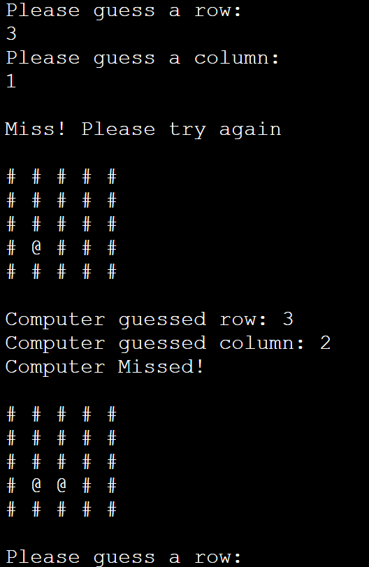

# You Sunk My Battleship!!

You sunk my battleship is a python terminal game, which runs in the Code Institute mock terminal on Heroku. 

Can you win against the computer? Find and sink the battleship hidden on the playing board and the gloy is yours!!

[Please view my live project here](https://you-sunk-my-battleship.herokuapp.com/)

Screenshot of live project below:

## Purpose of this project

I designed this project to be a simplified version of the game battleships. It can be enjoyed by any user who may come across my site. It is simple, fun and if you know the classic battleship game there is almost no learning curve. 

[Learn about the classic battleships game here](https://en.wikipedia.org/wiki/Battleship_(game))

## User Stories

* As a fist time user of this game I want the experience to be fun, stress free and easy to play. I feel that I have achieved this through simple to follow prompts and full exception handling which will always bring the user back on track to secure that win against the computer.
* As a user I want to be able to enter my name and have it displayed on screen while the game is running.
* As a user I want to be able to guess the coordinates of where I think the battleship is and also let me know if I have missed or hit the ship.
* As a user I want the game to alert me if I have won or lost and reveal the positoin of the ship on the playing board.
* As a gamer I want there to be a specific amount of guesses allowed before the game is over so it is a challenge to win which will encourage me to play again.
* As a gamer I would expect to be penalised if I make a duplicate guess or if my guess is out of the bounds of the playing board. The penalty would be to lose a turn. 

## Features

### Existing features

* The player is greeted with a welcome message, the game board is described, the coordinates layout is explained and the player is told they only have 5 guesses to try and win. 
* The player is then asked to input their name and upon entering valid data they are wished good luck in the battle against the computer.
* The computer generates a 5 x 5 square board.
* A ship is randomly placed and hidden within the board 
* The user is then prompted to guess a row and a colum to try and sink the ship.
* Once valid coordinates are entered the user is told if its a miss or a hit. 
* If the user missed the board is printed again, updated with the guessed coordinates replacing the "#" with a "@" 
* If its a hit the user is congratulated on their win and the program ends.
* The computer will then take a turn and the board is updated accordingly also.
* The game will then continues until there is a hit form the user or the computer.
* The game will also end if the amount or turns exceeds 5 and the user is encouraged to play again.
* Included in the code is input validation / exception handling. User can only use integers when guessing, the guesses must be within the bounds of the playing board and the user cannot make the same guess twice. If any of these actions are executed an on screen warning explains that the user loses a turn and is asked to guess again until there is no more guesses.

### Future Features

I would like to add a player and a computer as well a having multiple ships on each board.

## Technology

* The only coding language used in this project was the [Python](https://en.wikipedia.org/wiki/Python_(programming_language)) programming language.
* [Heroku](https://heroku.com/) - This clound based platform was used to deploy the project.
* [GitHub](https://github.com/) was used to keep a history of the development process.
* A [GitPod](https://gitpod.io/) workspace was used to write and test all code written during this project.

## Testing

### Code Validation

* All Python code used in this project was passed through the [PEP8](http://pep8online.com/) online code validator and no errors were returned. 
* Other testing was done directly in the GitPod terminal throughout the development process as well as using print statements to check the code was working along the way. 

### Screenshots

#### Computer win screenshot:
Here we see how the board is updated with the location of a battleship hit marked with an "*". In this particular case the computer won but if the user wins the boards prints the same way but with a different message above. 

### Invalid guess screenshot:
Here we see what happens when a user enters a string value instead of a number. This counts as a turn for the user and can only do this 5 times before the program ends. 

### Miss screenshot:
Here we can see that the player guess has missed and the playing board has been updated with the guessed coordinates by replacing the "#" with a "@". This will continue for each guess until the turn limit is reached or there is a winner.

### No more guesses screenshot:
Here we see the board is updated with many computer and player misses. The user is told they have no more guesses and is wished luck in their next attempt.

### Out of bounds guess screenshot 
Here we see what happens if the user makes a guess which is off the board. They are informed that they lose a turn and to only use numbers within the allowed range.

## Fixed Bugs

I ran into a couple of bugs while writing this game.
* I tried using a for loop to keep track of the guesses but it did not work the way I intended. My solution was to create a global variable and increment it by one every time the user made a correct guess, duplicate guess or an out of bounds guess. 
* Another bug I came across was after creating the check_row and check_col functions the if statements in the player_guess funtion gave an error as I had converted the variable values. I ammended this by wrapping the variables within the function with int() methods so they were read as integers.
* The last bug I came across was that if the user kept guessing string values the program would never end so I added the turn counter to check_row and check_col to limit string guesses to 5.

## Deployment

This project was built entirely using GitHub and GitPod.
* First I created a repository in my GitHub account and named it appropriately.
* Then I was able to create a GitPod workspace which included the Code Institute template where I was able to write and save all my code online.
* This service has been invaluable to creating all my projects and I would be lost without it.  

This project was deployed using Code Institute's mock terminal for Heroku. Steps for deployment on the Heroku site are as follows:
* Create a new app on the Heroku site 
* Add build pack ensuring Python is at the top and nodjs is below that.
* Head to the deploy tab and choose github as the deployment method. 
* Add the project repository and then you can deploy.

## Credits 

* [Code Institute](https://codeinstitute.net/) for deployment terminal.
* [Wikipedia](https://www.wikipedia.org/) for info on Battleship game and Python coding language.
* [Stack Overflow](https://stackoverflow.com/) for queries on code syntax.
* [GitHub](https://github.com/) for creating project repository.
* [Gitpod](https://gitpod.io/workspaces) for building the project in a workspace.
* [Heroku](https://heroku.com/) for deployinig the completed project.
* [PEP8](http://pep8online.com/) for validating all code within the project.
